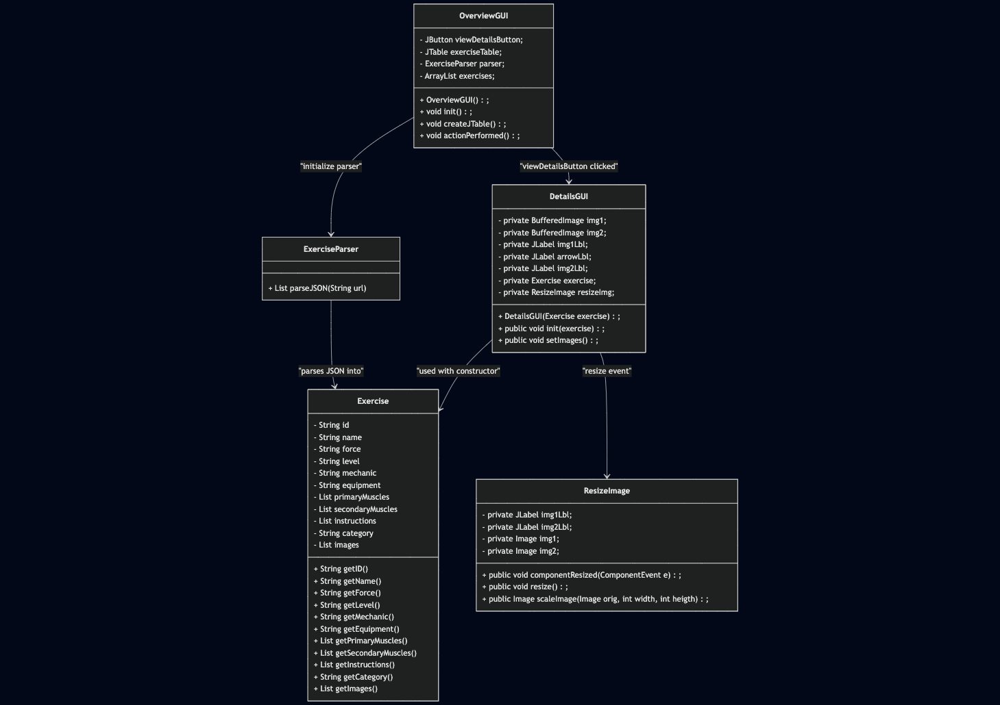
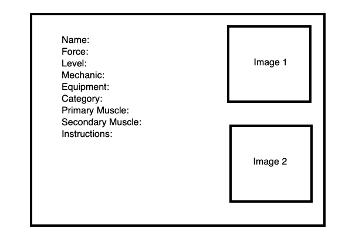
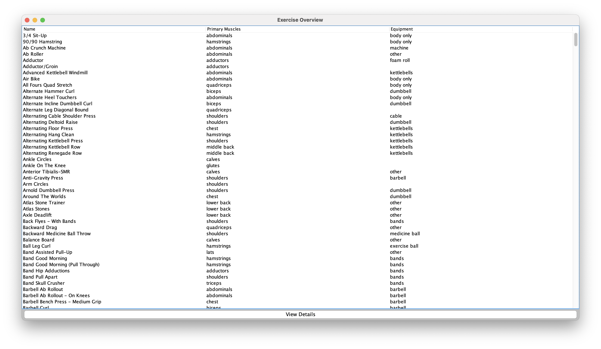

# Exercise Searcher
Final Project Proposal CS 121

FitSearch 

Proposal

Jake Terry, CS 121

## Overview

Many open-source exercise databases are in JSON format. The goal of this project is to convert JSON files into object instances, then store these objects in a data structure, such as an ArrayList. ArrayList will work well because we will not need to dynamically resize the ArrayList, I am not focused on adding elements to the ArrayList just yet. If progress permit, I may consider a different more dynamic data structure for users to add custom exercises. For now, an ArrayList will work to solve the main problem of this project -- converting JSON to objects, then presenting this information in a readable format.

## UML


## Open-Source Exercise DataBase

I will be using this data base, found [here](https://github.com/yuhonas/free-exercise-db?tab=readme-ov-file).

The basic schema of the JSON file is this: 
```
{
  "id": "Alternate_Incline_Dumbbell_Curl",
  "name": "Alternate Incline Dumbbell Curl",
  "force": "pull",
  "level": "beginner",
  "mechanic": "isolation",
  "equipment": "dumbbell",
  "primaryMuscles": [
    "biceps"
  ],
  "secondaryMuscles": [
    "forearms"
  ],
  "instructions": [
    "Sit down on an incline bench with a dumbbell in each hand being held at arms length. Tip: Keep the elbows close to the torso.This will be your starting position.",
  ],
  "category": "strength",
  "images": [
    "Alternate_Incline_Dumbbell_Curl/0.jpg",
    "Alternate_Incline_Dumbbell_Curl/1.jpg"
  ]
}
```
 Important to note, I will be using ```https://raw.githubusercontent.com/yuhonas/free-exercise-db/main/exercises/``` to access these files directly through github's hosting. By adding to the suffix, JSON and JPG files can be retrieved programmatically.

Example:  
[JSON](https://raw.githubusercontent.com/yuhonas/free-exercise-db/main/exercises/Alternate_Incline_Dumbbell_Curl.json)   
[JPG](https://raw.githubusercontent.com/yuhonas/free-exercise-db/main/exercises/Alternate_Incline_Dumbbell_Curl/0.jpg)


## Exercise Class

Using the JSON Schema, the Exercise class will have these attributes and methods:

```
public Class Exercise()
====================
String id
String name
String force
String level
String mechanic
String equipment
List<String> primaryMuscles
List<String> secondaryMuscles
List<String> instructions
String category
List<String> images
====================
Exercise()
String getID
String getName
String getForce
String getLevel
String getMechanic
String getEquipment
List<String> getPrimaryMuscles
List<String> getSecondaryMuscles
List<String> getInstructions
String getCategory
List<String> getImages
```

## ExerciseParser

The parser will be responsible for retrieving the JSON file and deserializing into object instances. So we do not make 800 requests from github, there exists a JSON file in this database that contains all the exercises in one file.  
Found here: [All Exercises](https://raw.githubusercontent.com/yuhonas/free-exercise-db/main/dist/exercises.json)

GSON will be the libary used for deserialization. The idea is to parse the JSON file, and return an ArrayList of Exercise objects.

In order to implement the parser I will need these libraries:

* java.NET.* - gives me access to the URL class
* java.util.* - For the List interface
* java.io.* - for InputStreamReader 
* com.google.gson.* - using Googles JSON to Object convereter.
* com.google.gson.reflect.TypeToken - for the TypeToken class
* java.lang.reflect.Type - for the Type class


### Installing GSON Libraries
GSON is not native to Java so I will have to download the [jar](https://repo1.maven.org/maven2/com/google/code/gson/gson/2.10.1/) file and give the compiler special instructions: ```- cp ".:libraries/gson-2.10.1.jar"```. This means use the code in the current directory and the GSON library in the libraries folder.

```
javac -cp ".:libraries/gson-2.10.1.jar" ....
java -cp ".:libraries/gson-2.10.1.jar" ....
```

### GSON Methods

Gson class contains a method ```.fromJson(input, type)```. This converts the JSON into an object of "type". Since we want to store the JSON strings into an ArrayList it is necessary to define the type before hand. Java needs a way to represent generic types, therefore we use do this:

```
Type exerciseList = new TypeToken<ArrayList<Exercise>>(){}.getType();
```

Gson provides ```TypeToken``` as a class for this situation. Gson docs state you do this by creating an empty anonymous class. 

```.getType()``` returns the ```ArrayList<Exercise>``` as a type object.

 

## GUI

I want to present this information through a GUI. The GUI will retrieve the data stored in the ArrayList and present it in a clean manner. There will be two GUIs, one that shows a detailed view of a single exercise, and another that will allow users to browse the ArrayList of exercise data.  

### Use Case

Load the GUI and have pages users can cycle through to explore data. Have an interactable button that when clicked, will give more detailed information about that specific exercise.

#### DetailsGUI:  


Uses a GridLayout of 2 rows and 1 column. The exercise data will be at the top, with picture examples at the botom of the window.

```pnlData``` will contain the Exercise JSON attributes and display them. I chose to use the JTextArea because the data for each exercise varies. Some have larger amounts of text than others. JTextArea supports text wrapping and so it is dynamic for resizing. This panel will be inserted into a JScrollPane in the event that the text is cut off. 

```pnlImg``` will contain two images along a horizontal axis. I grab the images by getting the image url from the ```getImages()``` method inside the Exercise class. Concatenate that onto the end of the url and it will pull each image.  

In order to have the images fit inside the panel comfortably, resizing is done. I get the original image, then use a ComponentListener to listen for window resizing. If it detects a resizing event, a scaleImage method is triggered. 

* The scaledImage method dynamically resizes the images to match the size of the labels. Since not all the images in this database are the same size, I had to write a custom method that sizes the images based on their aspect ratio.  
```
int maxWidth = img1Lbl.getWidth(); // label width
int maxHeight = img1Lbl.getHeight(); // label height

-----------------------------
private Image scaleImage(BufferedImage original, int maxWidth, int maxHeight) {
  int originalWidth (of the image)
  get originalHeight (of the image)

  get double widthRatio from maxWidth / originalWidth
  get double heightRatio from maxHeight/ originalHeight
  determine which ratio is smaller and assign it to ratio
  
  int newWidth is originalWidth * ratio 
  int newHeight is originalHeight * ratio

  convert newWidth, newHeight from double to integer using casting.

  scale original image with getScaledInstance method
  
  return scaled image
}

```

#### OverviewGUI
Preferably, the GUI will be set up like this:  
  

The user selects an exercise from the list, then clicks the view details button. This will open a new window with the detailed view explained earlier. 
## Milestones

- [x] Define Exercise object class.  
- [x] Get URL with JSON file.  
- [x] Parse JSON into a ArrayList<Exercise>.  
- [x] Read ArrayList<Exercise> into GUI interface.  
- [x] Create Detailed GUI.  
- [x] Create Overview GUI. 
- [ ] Create filtering methods. 

## Blackbelt 

* SearchBy/filter function - ability to search by name, equipment, muscle groups, etc.
* Workout planner - ability to select workouts to incorporate into a workout program.
* Progression tracker - use serialization to track workouts done, weight lifted, max, etc.

## After Action

* GUI ARE HARD but I learned a lot.
